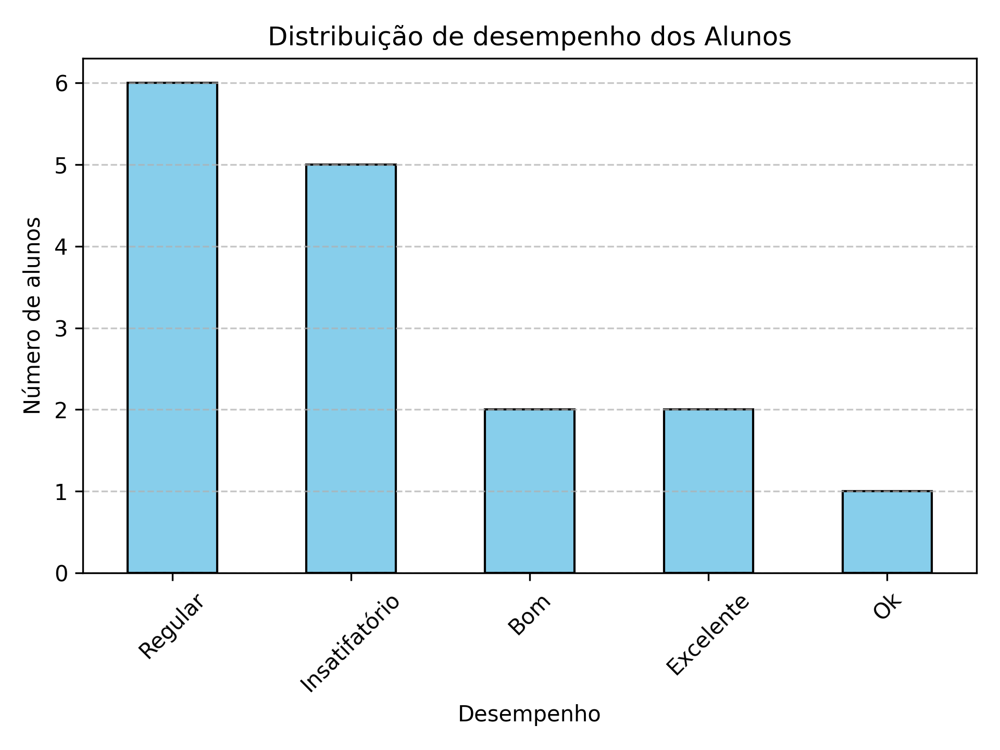

# 📊 Análise de Desempenho Escolar

Projeto de análise de dados que avalia o desempenho de alunos a partir de suas notas. Utiliza Python, Excel e Power BI para gerar insights e visualizações.

## 🧠 O que o projeto faz

- Lê um arquivo CSV com notas de alunos.
- Classifica os alunos em categorias de desempenho (Excelente, Bom, Regular, etc.).
- Gera estatísticas como média geral, maior e menor nota.
- Cria um gráfico de barras com a distribuição de desempenho.
- Exporta os dados finais para um novo CSV.
- Utiliza Excel para análise de dados e Power BI para visualizações interativas.

## 🛠️ Tecnologias usadas

- Python
- Pandas
- Matplotlib
- CSV
- Excel
- Power BI

